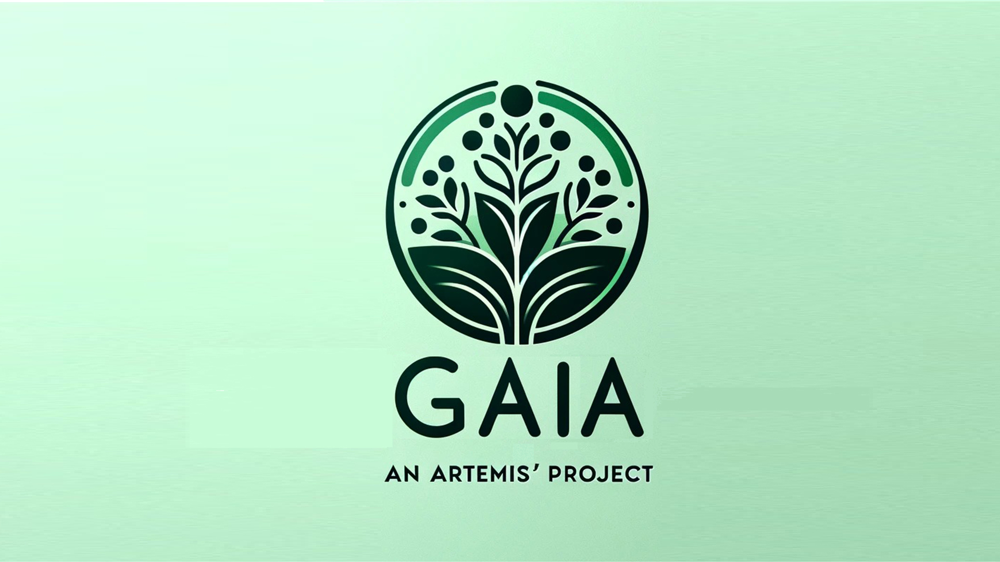

# Gaia, an Artemis' project

Gaia is a urban garden management app that aims to help participants to organize the personal tasks, the crops they are taking care of and exchange products within their communities.


## Installation

If you´have ```flutter``` installed on your computer, download the repository and execute
```bash
flutter build apk
```
Then, download the APK and install it on your device
## Usage

### Home page

<p align="center">
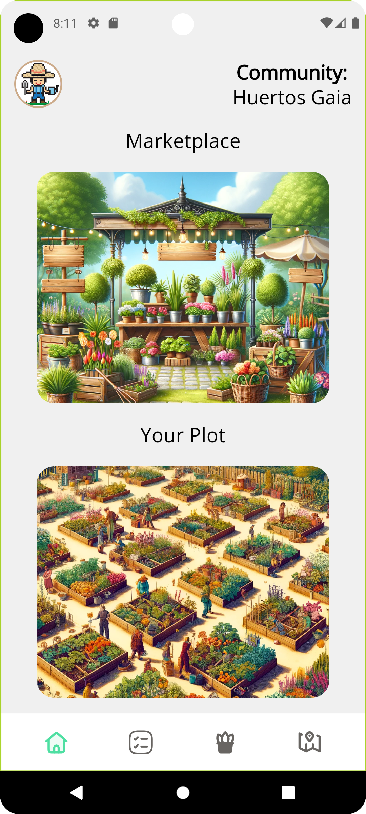 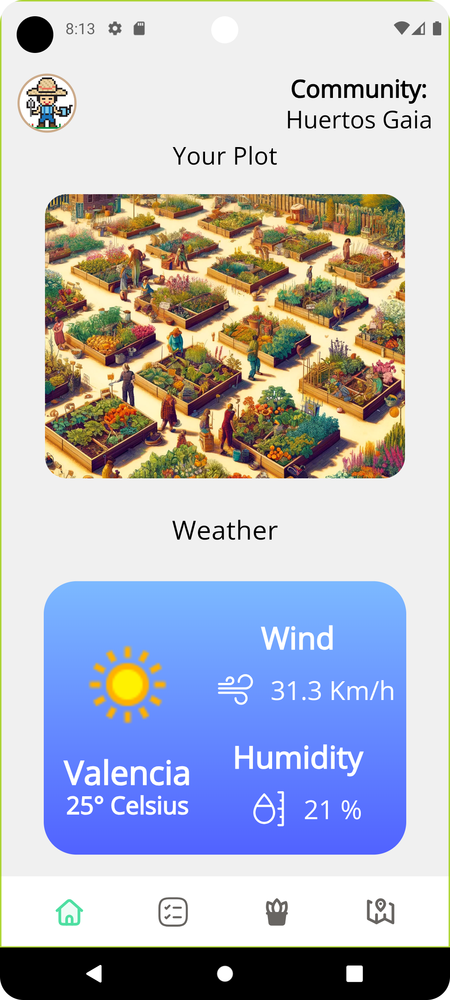
</p>

Here you will find three useful sections, the Marketplace, the Land, and the Weather forecast:

#### MarketPlace

<p align="center">
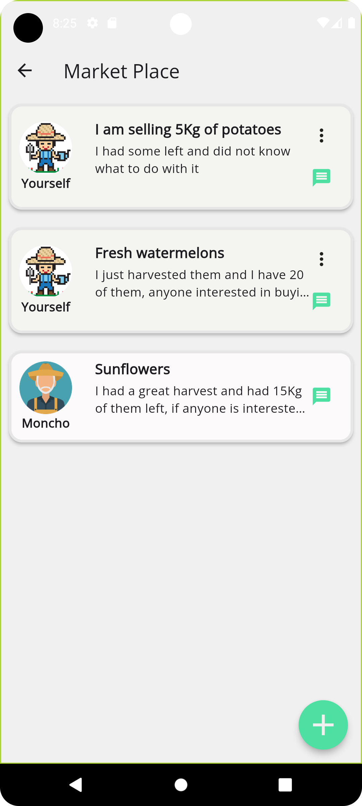 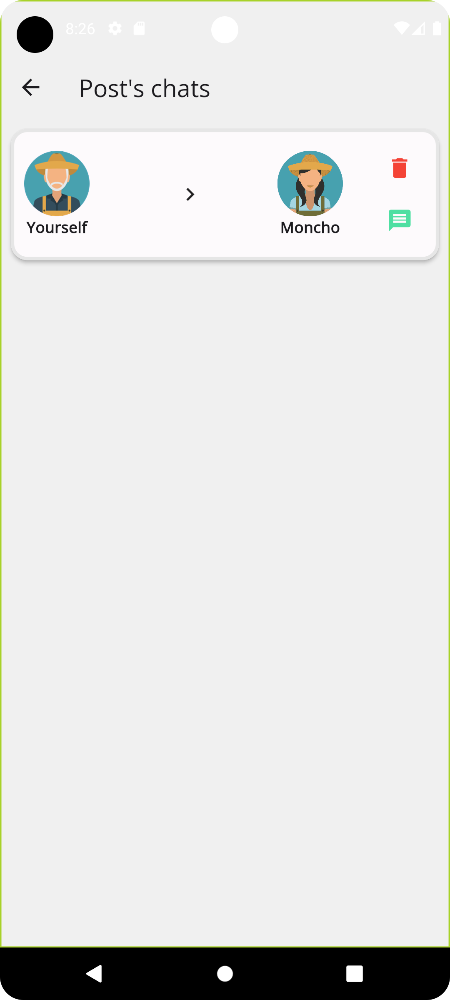 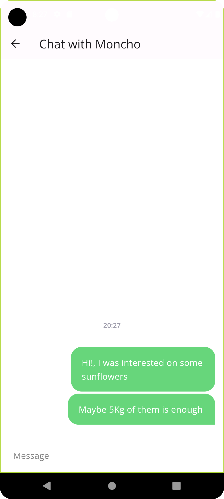
</p>

Here you will be able to upload posts in which you can sell your products within your community, or you can also search for other members' posts, and send them a message related to their post.

#### Land

<p align="center">
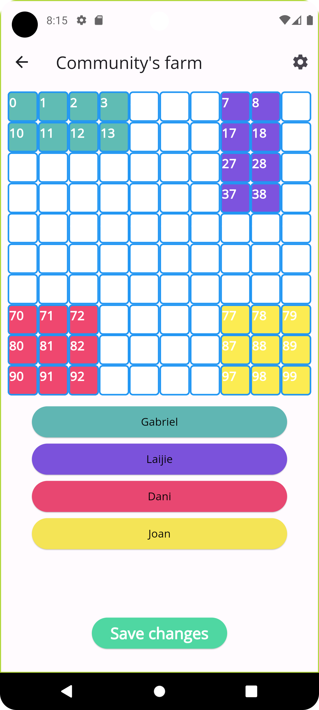
</p>

In order to manage the distribution of the lands, the manager of the community will be able to determine the land size and to select which plots correspond to which user, and the users can take a look to this distribution.

#### Weather forecast

<p align="center">
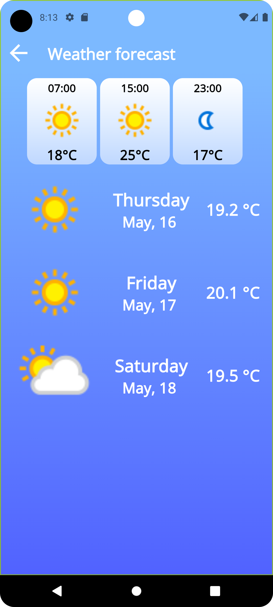
</p>

Obtain a forecast of the weather to prepare yourself and your plants for any situation.

### To-Do

<p align="center">
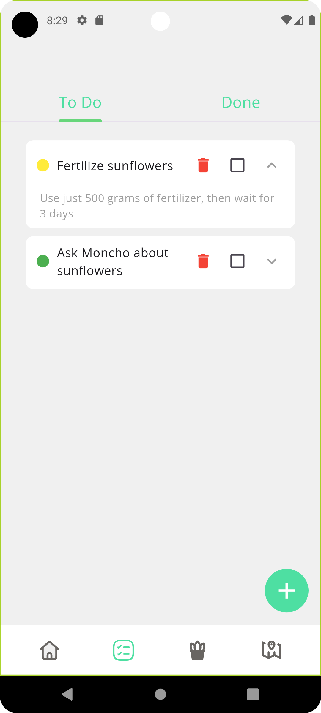 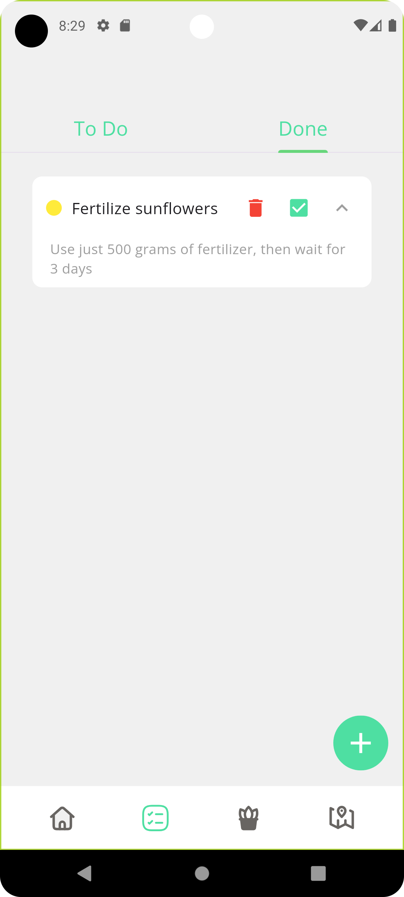
</p>

Manage your tasks and remind yourself of the things you have to do. You can also set a priority on this tasks in order to know what are the most important.

### Plants

<p align="center">
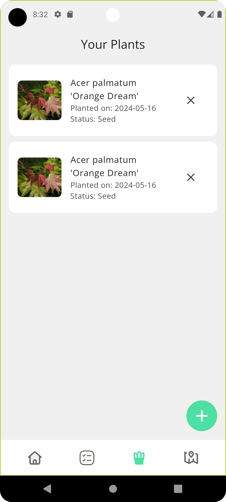 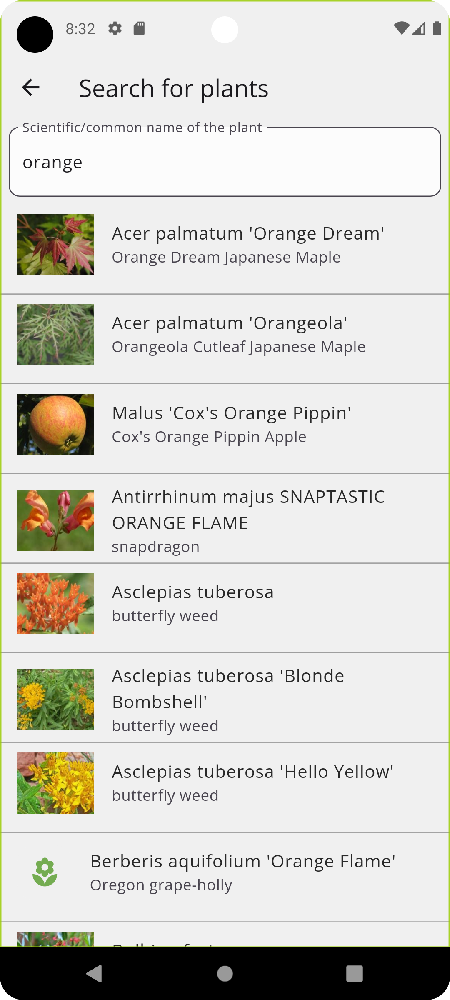 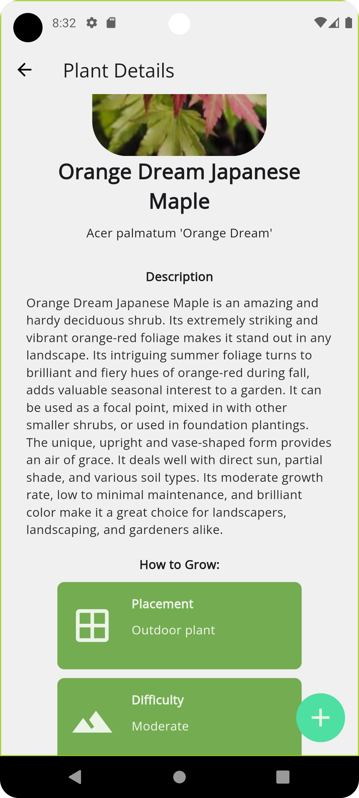
</p>

Manage the crops that you are growing, and obtain useful information about how to grow them.

### Map

<p align="center">
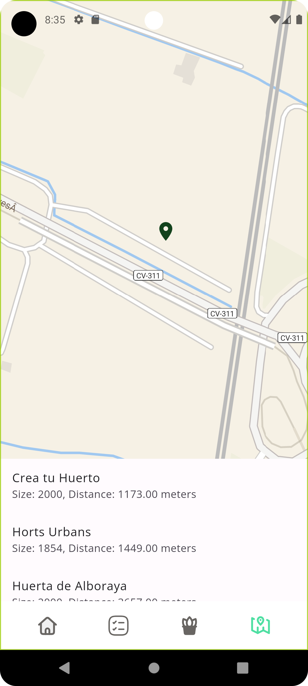
</p>

Locate the nearest 'Urban garden' communities and connect with their members

## Tech Stack

**Frontend:** Flutter

**Backend:** Supabase

**Other tools:** Perenual API, Google Maps API, Weather API

